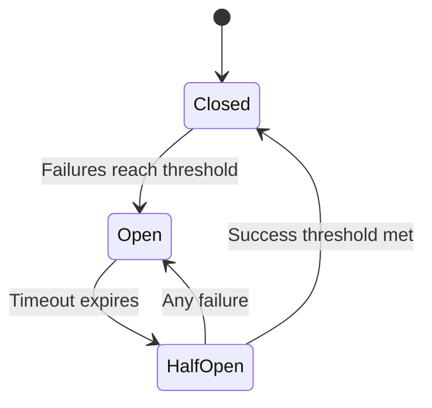
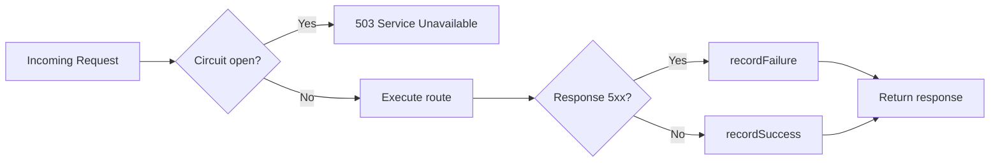

# Laravel Circuit Breaker

[](https://github.com/gabrielanhaia/laravel-circuit-breaker/actions)
[](https://packagist.org/packages/gabrielanhaia/laravel-circuit-breaker)
[](https://packagist.org/packages/gabrielanhaia/laravel-circuit-breaker)
[](https://packagist.org/packages/gabrielanhaia/laravel-circuit-breaker)
[](LICENSE)
[](https://www.buymeacoffee.com/gabrielanhaia)

<p align="center">
  
</p>

A Laravel integration for [PHP Circuit Breaker](https://github.com/gabrielanhaia/php-circuit-breaker) v3 with multiple storage drivers, HTTP middleware, Artisan commands, and full event system integration.

## What Is a Circuit Breaker?

When your application calls an external service (payment gateway, email API, etc.), that service can become slow or unresponsive. Without protection, your application keeps sending requests — piling up timeouts, wasting resources, and degrading user experience.

A **circuit breaker** monitors failures and automatically stops calling a failing service, giving it time to recover. It works like an electrical circuit breaker: when too many failures occur, the circuit "opens" and all requests fail fast without actually hitting the remote service.



| State       | Behaviour                                                                  |
|-------------|----------------------------------------------------------------------------|
| **Closed**    | Normal operation. Requests pass through. Failures are counted.           |
| **Open**      | Requests are blocked immediately (fail fast). No calls reach the service.|
| **Half-Open** | A limited number of probe requests are allowed through to test recovery. |

## Requirements

- PHP ^8.2
- Laravel ^11.0 or ^12.0
- [gabrielanhaia/php-circuit-breaker](https://github.com/gabrielanhaia/php-circuit-breaker) ^3.0 (installed automatically)

## Installation

```bash
composer require gabrielanhaia/laravel-circuit-breaker
```

Publish the configuration file:

```bash
php artisan vendor:publish --tag=circuit-breaker-config
```

## Configuration

After publishing, the config lives at `config/circuit_breaker.php`.

### Storage Driver

Choose where circuit state is persisted:

```php
<?php
// config/circuit_breaker.php

return [
    'default_driver' => env('CIRCUIT_BREAKER_DRIVER', 'redis'),

    'drivers' => [
        'redis' => [
            'connection' => env('CIRCUIT_BREAKER_REDIS_CONNECTION', 'default'),
            'prefix'     => 'cb:',
        ],
        'apcu' => [
            'prefix' => 'cb:',
        ],
        'memcached' => [
            'connection' => env('CIRCUIT_BREAKER_MEMCACHED_CONNECTION', 'memcached'),
            'prefix'     => 'cb:',
        ],
        'array' => [],
    ],
    // ...
];
```

| Driver       | Best for                          | Requirement              |
|--------------|-----------------------------------|--------------------------|
| `redis`      | Distributed / multi-server apps   | `ext-redis` (phpredis)   |
| `apcu`       | Single-server, high performance   | `ext-apcu`               |
| `memcached`  | Distributed caching               | `ext-memcached`          |
| `array`      | Testing and local development     | none                     |

> **Note:** The Redis driver requires the **phpredis** PHP extension. Predis is not supported by the underlying storage adapter.

### Default Thresholds

```php
<?php
// config/circuit_breaker.php

return [
    // ...
    'defaults' => [
        'failure_threshold'  => 5,     // Number of failures to open the circuit
        'success_threshold'  => 1,     // Successes in half-open to close the circuit
        'time_window'        => 20,    // Seconds in which failures are counted
        'open_timeout'       => 30,    // Seconds the circuit stays open before half-open
        'half_open_timeout'  => 20,    // Seconds the circuit stays half-open
        'exceptions_enabled' => false, // true = throw OpenCircuitException instead of returning false
    ],
    // ...
];
```

### Per-Service Overrides

Different services can have different thresholds. Any key you omit falls back to the value in `defaults`:

```php
<?php
// config/circuit_breaker.php

return [
    // ...
    'services' => [
        'payment-api' => [
            'failure_threshold' => 3,   // More sensitive — fewer failures to trip
            'open_timeout'      => 60,  // Longer cooldown
        ],
        'email-service' => [
            'failure_threshold' => 10,  // More tolerant
        ],
    ],
];
```

## Usage

### Facade

```php
<?php

namespace App\Services;

use GabrielAnhaia\LaravelCircuitBreaker\Facades\CircuitBreaker;
use Illuminate\Support\Facades\Http;

class PaymentService
{
    public function charge(array $data): mixed
    {
        if (!CircuitBreaker::canPass('payment-api')) {
            return $this->fallback();
        }

        try {
            $response = Http::timeout(5)->post('https://api.payment.example/charge', $data);

            CircuitBreaker::recordSuccess('payment-api');

            return $response->json();
        } catch (\Throwable $e) {
            CircuitBreaker::recordFailure('payment-api');

            return $this->fallback();
        }
    }

    private function fallback(): array
    {
        return ['status' => 'queued', 'message' => 'Payment will be retried shortly.'];
    }
}
```

### Dependency Injection

```php
<?php

namespace App\Services;

use GabrielAnhaia\LaravelCircuitBreaker\CircuitBreakerManager;
use Illuminate\Support\Facades\Http;

class PaymentService
{
    public function __construct(
        private readonly CircuitBreakerManager $circuitBreaker,
    ) {}

    public function charge(array $data): mixed
    {
        if (!$this->circuitBreaker->canPass('payment-api')) {
            return $this->fallback();
        }

        try {
            $response = Http::timeout(5)->post('https://api.payment.example/charge', $data);

            $this->circuitBreaker->recordSuccess('payment-api');

            return $response->json();
        } catch (\Throwable $e) {
            $this->circuitBreaker->recordFailure('payment-api');

            return $this->fallback();
        }
    }

    private function fallback(): array
    {
        return ['status' => 'queued'];
    }
}
```

### HTTP Middleware

The `circuit-breaker` middleware wraps an entire route. It blocks requests when the circuit is open and automatically records successes and failures based on the HTTP status code.



Register the middleware on your routes:

```php
<?php
// routes/api.php

use App\Http\Controllers\PaymentController;
use Illuminate\Support\Facades\Route;

Route::middleware('circuit-breaker:payment-api')
    ->post('/payments/charge', [PaymentController::class, 'charge']);

Route::middleware('circuit-breaker:email-service')
    ->post('/notifications/send', [NotificationController::class, 'send']);
```

When the circuit is open the middleware returns a JSON response:

```json
{
    "message": "Service unavailable."
}
```

with HTTP status **503 Service Unavailable**.

### Artisan Commands

```bash
# Check the current state of a service's circuit
php artisan circuit-breaker:status payment-api

# Force a state override (useful during deploys or incidents)
php artisan circuit-breaker:force payment-api open
php artisan circuit-breaker:force payment-api closed --ttl=300   # auto-expires in 5 min

# Remove a manual override and return to normal state logic
php artisan circuit-breaker:clear payment-api
```

## Events

All circuit breaker events are dispatched through Laravel's event system, so you can listen to them like any other Laravel event:

```php
<?php
// app/Providers/AppServiceProvider.php

namespace App\Providers;

use GabrielAnhaia\PhpCircuitBreaker\Event\CircuitOpenedEvent;
use GabrielAnhaia\PhpCircuitBreaker\Event\CircuitClosedEvent;
use GabrielAnhaia\PhpCircuitBreaker\Event\FailureRecordedEvent;
use GabrielAnhaia\PhpCircuitBreaker\Event\SuccessRecordedEvent;
use Illuminate\Support\Facades\Event;
use Illuminate\Support\Facades\Log;
use Illuminate\Support\ServiceProvider;

class AppServiceProvider extends ServiceProvider
{
    public function boot(): void
    {
        Event::listen(CircuitOpenedEvent::class, function (CircuitOpenedEvent $event): void {
            Log::warning("Circuit OPENED for [{$event->getServiceName()}]");
        });

        Event::listen(CircuitClosedEvent::class, function (CircuitClosedEvent $event): void {
            Log::info("Circuit CLOSED for [{$event->getServiceName()}]");
        });
    }
}
```

| Event                   | Fired when                                        |
|-------------------------|---------------------------------------------------|
| `FailureRecordedEvent`  | A failure is recorded                             |
| `SuccessRecordedEvent`  | A success is recorded                             |
| `CircuitOpenedEvent`    | The circuit transitions to **OPEN**               |
| `CircuitClosedEvent`    | The circuit transitions to **CLOSED**             |
| `CircuitHalfOpenEvent`  | The circuit transitions to **HALF_OPEN**          |

Every event exposes `getServiceName(): string` and `getOccurredAt(): DateTimeImmutable`.

## Manual Override

Force a circuit state for maintenance windows or during an incident:

```php
<?php

use GabrielAnhaia\LaravelCircuitBreaker\Facades\CircuitBreaker;
use GabrielAnhaia\PhpCircuitBreaker\CircuitState;

// Block all traffic to a service (force OPEN)
CircuitBreaker::forceState('payment-api', CircuitState::OPEN);

// Block for 5 minutes, then automatically return to normal state logic
CircuitBreaker::forceState('payment-api', CircuitState::OPEN, ttl: 300);

// Remove the override
CircuitBreaker::clearOverride('payment-api');
```

## Upgrade from v1

See [UPGRADE-2.0.md](UPGRADE-2.0.md) for step-by-step migration instructions.

## Development

```bash
composer test        # Run PHPUnit (unit + feature)
composer phpstan     # Static analysis — level max
composer cs-check    # Code style dry-run
composer cs-fix      # Auto-fix code style
```

## Support

If you find this package useful, consider supporting it:

<a href="https://www.buymeacoffee.com/gabrielanhaia" target="_blank">
  
</a>

## License

MIT. See [LICENSE](LICENSE) for details.
